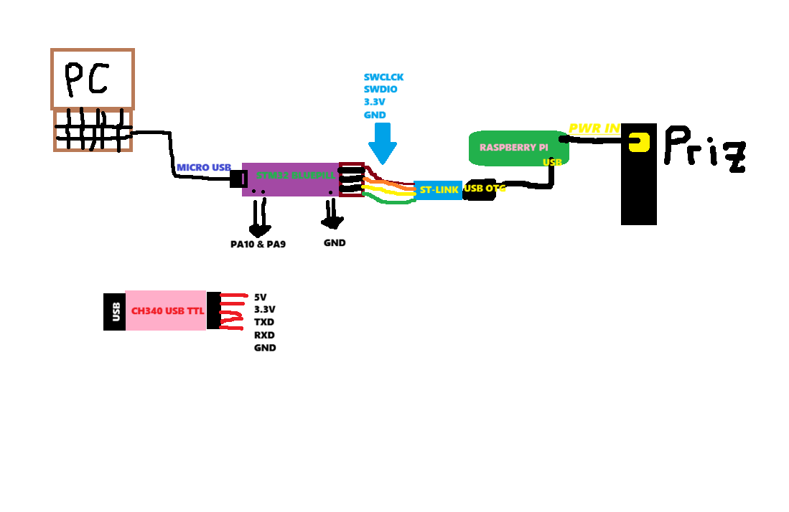
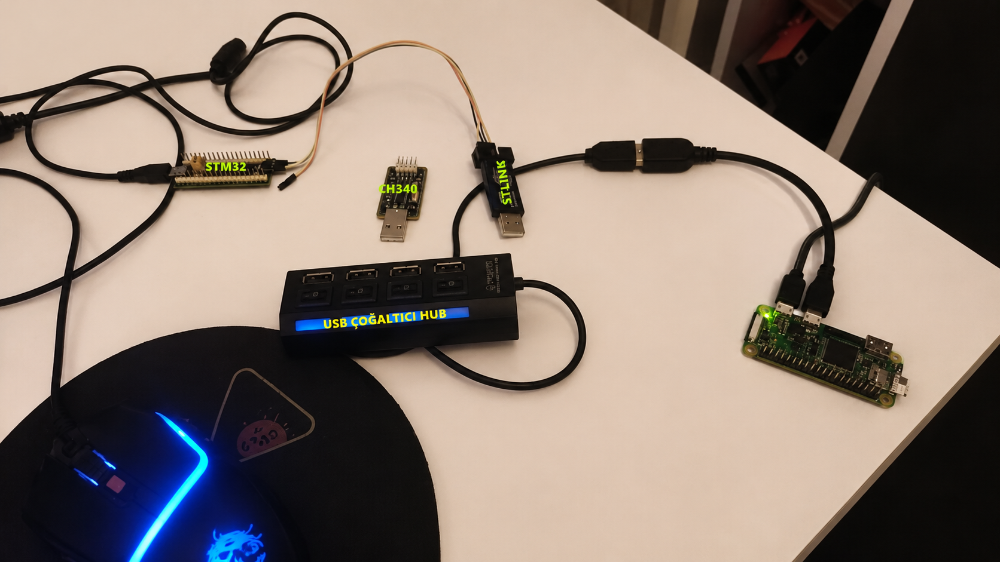
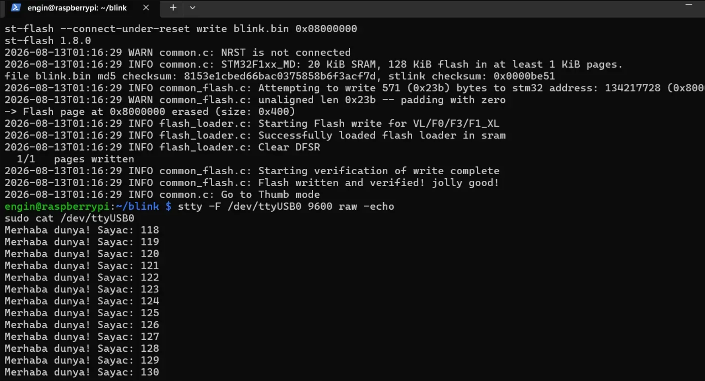
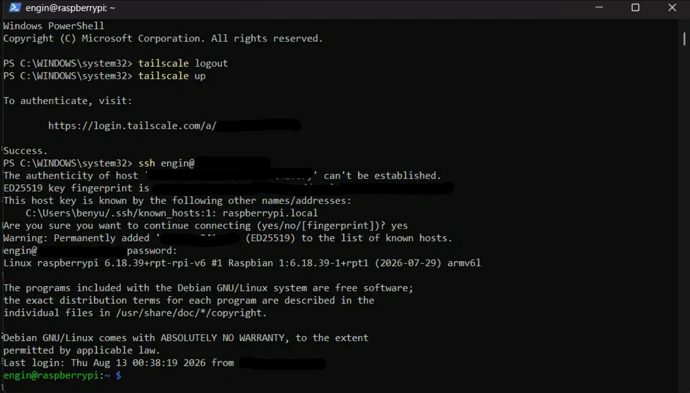

# Remote STM32 Debug Gateway

A Raspberry Pi-based gateway for remote flashing and debugging of STM32 microcontrollers over the network, using ST-Link/OpenOCD for programming and a UART bridge for live output verification. Accessible from anywhere via Tailscale VPN.

## Why

Embedded firmware development usually requires physical access to the target hardware. This project turns a Raspberry Pi Zero W into a remote gateway so that flashing and debugging an STM32 board — and confirming it actually runs — can be done from any network, without being physically present.

## Architecture



```
Remote machine (anywhere)
        |  Tailscale VPN (WireGuard-based, NAT traversal)
        v
Raspberry Pi Zero W
        |
        +-- ST-Link V2 --(SWD)--> STM32F103C8T6 (flash / debug)
        |
        +-- CH340 USB-TTL --(UART)--> STM32F103C8T6 (live serial output)
```

Two independent links to the target chip:
- **ST-Link over SWD** — programs the flash memory (OpenOCD / st-flash)
- **CH340 over UART** — reads live serial output from the running firmware, proving the code is actually executing

Both USB peripherals share a single powered hub connected to the Pi's only USB data port via an OTG adapter, and both draw board power from the same source (ST-Link's 3.3V rail) to avoid ground-loop issues between independently powered devices.

## Hardware

| Component | Role |
|---|---|
| Raspberry Pi Zero W | Remote gateway, runs OpenOCD/st-flash, hosts Tailscale |
| ST-Link V2 (clone) | SWD programmer/debugger |
| STM32F103C8T6 ("Blue Pill") | Target microcontroller |
| CH340 USB-TTL adapter | UART bridge for serial output |
| USB hub | Lets the Pi's single USB port serve both ST-Link and CH340 |
| Micro-USB OTG adapter | Connects the hub to the Pi's USB port |



## Software stack

- Raspberry Pi OS Lite (headless, SSH-only)
- OpenOCD 0.12.0 + `stlink-tools` (st-flash / st-info)
- `gcc-arm-none-eabi` toolchain for bare-metal firmware
- Tailscale for remote network access

## What it does

1. Firmware is cross-compiled on the Pi (or built elsewhere and copied over) into a raw `.bin`.
2. `st-flash` writes it to the STM32 over SWD via the ST-Link.
3. The firmware blinks the onboard LED and writes a counter message over UART.
4. The Pi reads `/dev/ttyUSB0` (the CH340 device) to confirm the firmware is running — this is the proof-of-life signal that flashing actually worked and the target is executing new code, not just that the write succeeded.
5. All of the above is reachable over Tailscale, so it works the same whether the operator is on the same LAN or on the other side of the world.

## Firmware

The `firmware/` folder contains a minimal bare-metal example (no HAL, direct register access):

- `startup.c` — vector table and reset handler
- `main.c` — blinks PC13 and sends a counter string over USART1 (PA9/PA10, 9600 baud)
- `stm32f103.ld` — linker script for the STM32F103C8T6 memory layout

Build:
```bash
arm-none-eabi-gcc -mcpu=cortex-m3 -mthumb -nostdlib -nostartfiles \
  -T stm32f103.ld -o blink.elf startup.c main.c
arm-none-eabi-objcopy -O binary blink.elf blink.bin
```

Flash:
```bash
st-flash --connect-under-reset write blink.bin 0x08000000
```

Read UART output:
```bash
stty -F /dev/ttyUSB0 9600 raw -echo
sudo cat /dev/ttyUSB0
```

## Proof of operation

Flash write and live UART output in the same session:



Flashing over Tailscale, from a network outside the Pi's local LAN:



## Notes from getting it working

A few non-obvious issues came up during setup, in case they're useful to someone else:

- **Locked target chip.** The Blue Pill initially failed to connect over SWD (`init mode failed`, later `external reset detected` loops) because factory firmware was reconfiguring the SWD pins as GPIO shortly after reset. Fixed with `st-flash --connect-under-reset erase` to mass-erase the flash before the errant firmware could run.
- **Ground loop / spontaneous Pi reboot.** Powering the target board from a second, independent source (a PC's USB port) while it was also connected to the Pi-powered ST-Link caused the Pi to reboot unexpectedly. Resolved by powering the whole chain from a single source (Pi → ST-Link → target).
- **Garbled UART output.** Output was unreadable until the USART baud-rate register was corrected — `BRR = 0x0341` for 9600 baud at the STM32's default 8 MHz internal clock (an earlier, incorrect value produced ~12800 baud, which read as garbage at a 9600 terminal setting).

## Roadmap

- [ ] Web-based flash/log interface instead of raw SSH
- [ ] Extend to STM32WL55 (LoRaWAN) target
- [ ] Automated flash-and-verify test on every firmware push (CI-driven hardware-in-the-loop)
