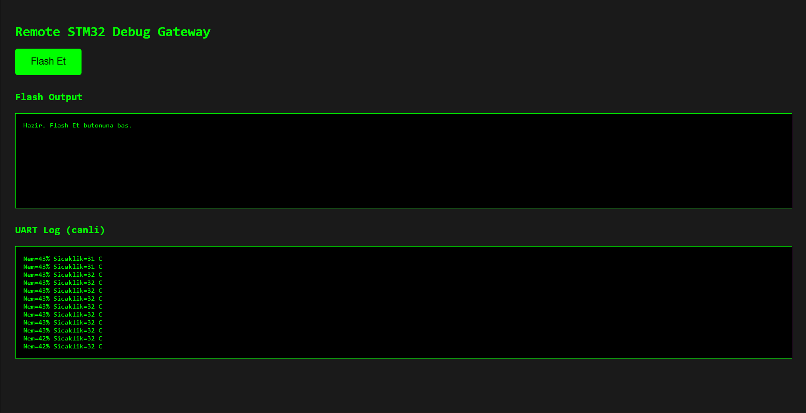
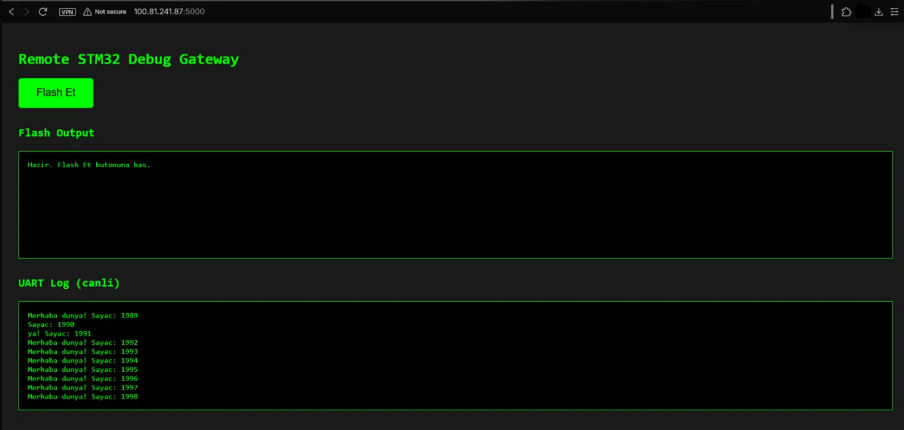

# Remote STM32 Debug Gateway

A Raspberry Pi-based gateway for remote flashing and debugging of STM32 microcontrollers over the network, using ST-Link/OpenOCD for programming and a UART bridge for live output verification. Accessible from anywhere via Tailscale VPN.

## Why

Embedded firmware development usually requires physical access to the target hardware. This project turns a Raspberry Pi Zero W into a remote gateway so that flashing and debugging an STM32 board, and confirming it actually runs, can be done from any network, without being physically present.

## Architecture


```
Remote machine (anywhere)
        |  Tailscale VPN (WireGuard-based, NAT traversal)
        v
Raspberry Pi Zero W
        |
        +-- ST-Link V2 --(SWD)--> STM32F103C8T6 (flash / debug)
        |
        +-- CH340 USB-TTL --(UART)--> STM32F103C8T6 (live serial output)
```

Two independent links to the target chip:
- **ST-Link over SWD**: programs the flash memory (OpenOCD / st-flash)
- **CH340 over UART**: reads live serial output from the running firmware, proving the code is actually executing

Both USB peripherals share a single powered hub connected to the Pi's only USB data port via an OTG adapter, and both draw board power from the same source (ST-Link's 3.3V rail) to avoid ground-loop issues between independently powered devices.

## Hardware

| Component | Role |
|---|---|
| Raspberry Pi Zero W | Remote gateway, runs OpenOCD/st-flash, hosts Tailscale |
| ST-Link V2 (clone) | SWD programmer/debugger |
| STM32F103C8T6 ("Blue Pill") | Target microcontroller |
| CH340 USB-TTL adapter | UART bridge for serial output |
| USB hub | Lets the Pi's single USB port serve both ST-Link and CH340 |
| Micro-USB OTG adapter | Connects the hub to the Pi's USB port |


## Software stack

- Raspberry Pi OS Lite (headless, SSH only)
- OpenOCD 0.12.0 + stlink-tools (st-flash / st-info)
- gcc-arm-none-eabi toolchain for bare-metal firmware
- Tailscale for remote network access

## What it does

1. Firmware is cross-compiled on the Pi (or built elsewhere and copied over) into a raw .bin file.
2. st-flash writes it to the STM32 over SWD via the ST-Link.
3. The firmware blinks the onboard LED and writes a counter message over UART.
4. The Pi reads /dev/ttyUSB0 (the CH340 device) to confirm the firmware is running. This is the proof-of-life signal that flashing actually worked and the target is executing new code, not just that the write succeeded.
5. All of the above is reachable over Tailscale, so it works the same whether the operator is on the same LAN or on the other side of the world.

## Firmware

The firmware/ folder contains a minimal bare-metal example (no HAL, direct register access):

- startup.c: vector table and reset handler
- main.c: blinks PC13 and reads a DHT11 temperature/humidity sensor via bit-banged single-wire protocol, sending readings over USART1 (PA9/PA10, 9600 baud)
- stm32f103.ld: linker script for the STM32F103C8T6 memory layout

The DHT11 is wired to PA0 (data), 3.3V, and GND. Reading it requires precise microsecond-level timing (an 18ms start pulse, then decoding 40 bits based on pulse width), implemented using the Cortex-M SysTick timer for delays. An earlier version used the STM32's internal temperature sensor via ADC1 channel 16, but this repeatedly caused a HardFault during ADC calibration; switching to the DHT11's simpler digital protocol avoided the ADC register issues entirely and gave more useful data (temperature and humidity, not just temperature).

Build:
```bash
arm-none-eabi-gcc -mcpu=cortex-m3 -mthumb -nostdlib -nostartfiles \
  -T stm32f103.ld -o blink.elf startup.c main.c
arm-none-eabi-objcopy -O binary blink.elf blink.bin
```

Flash:
```bash
st-flash --connect-under-reset write blink.bin 0x08000000
```

Read UART output:
```bash
stty -F /dev/ttyUSB0 9600 raw -echo
sudo cat /dev/ttyUSB0
```

## Proof of operation

Flash write and live UART output in the same session:


Flashing over Tailscale, from a network outside the Pi's local LAN:


Live DHT11 sensor readings streamed through the web interface:



## Notes from getting it working

A few non-obvious issues came up during setup, in case they're useful to someone else:

- **Locked target chip.** The Blue Pill initially failed to connect over SWD (init mode failed, later external reset detected loops) because factory firmware was reconfiguring the SWD pins as GPIO shortly after reset. Fixed with st-flash --connect-under-reset erase to mass-erase the flash before the errant firmware could run.
- **Ground loop / spontaneous Pi reboot.** Powering the target board from a second, independent source (a PC's USB port) while it was also connected to the Pi-powered ST-Link caused the Pi to reboot unexpectedly. Resolved by powering the whole chain from a single source (Pi to ST-Link to target).
- **Garbled UART output.** Output was unreadable until the USART baud-rate register was corrected: BRR = 0x0341 for 9600 baud at the STM32's default 8 MHz internal clock (an earlier, incorrect value produced roughly 12800 baud, which read as garbage at a 9600 terminal setting).
- **ADC HardFault on the internal temperature sensor.** Reading the STM32's internal temperature sensor through ADC1 channel 16 reliably caused a HardFault during the calibration step (confirmed with openocd's halt command, which showed the core stuck in the HardFault handler). Rather than continue debugging the ADC calibration sequence, the firmware was switched to a DHT11 external sensor instead, which uses a simple digital protocol and avoided the issue entirely.
- **Split UART lines in the web interface.** The Flask /uart endpoint originally opened and closed the serial port on every poll, sometimes catching a sensor reading mid-line and displaying it broken across two page refreshes. Fixed by buffering completed lines server-side and only displaying whole lines, discarding any partial line still in progress.

## Roadmap

- [x] Web-based flash/log interface instead of raw SSH
- [x] Read a real sensor (DHT11 temperature/humidity) instead of a synthetic counter
- [x] Automated flash-and-verify test on every firmware push (CI-driven hardware-in-the-loop)
- [ ] Extend to STM32WL55 (LoRaWAN) target

## Web interface

A minimal Flask web UI (`web/app.py`) replaces raw SSH for day-to-day use: a "Flash Et" button triggers the same `st-flash` command shown above, and a live UART panel polls `/dev/ttyUSB0` once per second so firmware output is visible directly in the browser, no terminal required.

Reachable over the local network or, via Tailscale, from anywhere:



Run it:
```bash
cd web
pip install flask pyserial --break-system-packages
python3 app.py
```

Then open `http://<pi-address>:5000` (local IP or Tailscale IP) in a browser.


## Continuous integration (hardware-in-the-loop)

GitHub's official Actions runner requires ARMv7+; since the Pi Zero W uses the older ARMv6 instruction set, the .NET-based runner segfaults during configuration (a known, documented limitation of the official runner, not specific to this project -- see [actions/runner#688](https://github.com/actions/runner/issues/688)).

Instead of the official runner, the `ci/` folder contains a small polling-based watcher (`ci_watcher.py`) that achieves the same push-to-test automation without depending on ARMv7:

1. Every 60 seconds, the Pi checks the GitHub API for the latest commit on `main` (authenticated with a personal access token, since the repo is private).
2. On a new commit: pulls the change, cross-compiles the firmware, flashes it over SWD, then reads the UART for 8 seconds.
3. If the output contains real sensor readings (`Sicaklik=` and `Nem=`), the pipeline is marked PASS; otherwise FAIL. Every step is logged with a timestamp.

This design makes only outbound requests to GitHub -- no inbound port is opened, so there's nothing on the network for an attacker to reach. A `systemd` unit (`ci/ci-watcher.service`) keeps the watcher running persistently and restarts it automatically if it crashes or the Pi reboots.

Example log from a real push-triggered run:

```
[21:01:17] New commit found: d50360b217e70316e2dd2f931df156147951baeb
[21:01:17] === New commit detected, starting pipeline ===
[21:01:20] git pull: exit=0
[21:01:23] compile: exit=0
[21:01:24] flash: exit=0
[21:01:24] Flash successful, reading UART for verification...
[21:01:34] PASS: sensor output detected
Nem=35% Sicaklik=34 C
[21:01:34] === Pipeline PASSED ===
```
